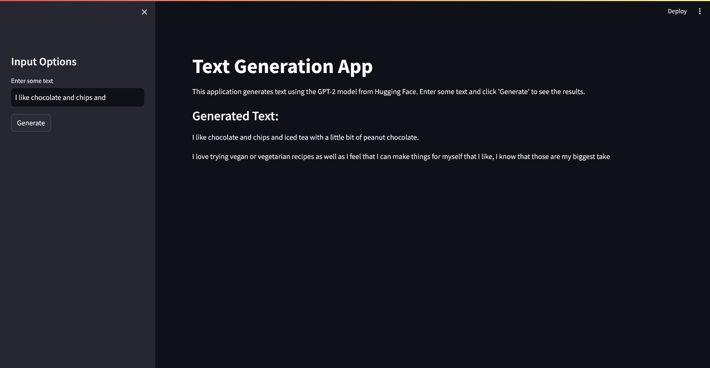
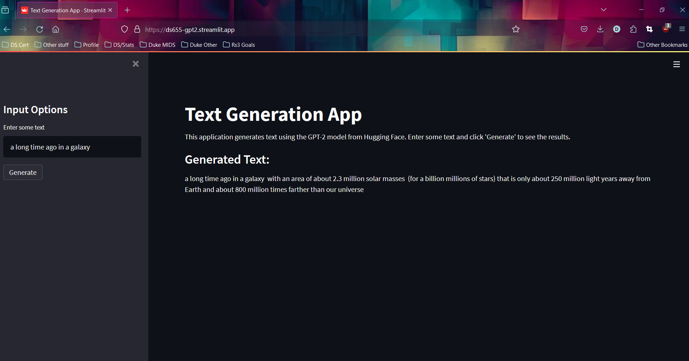
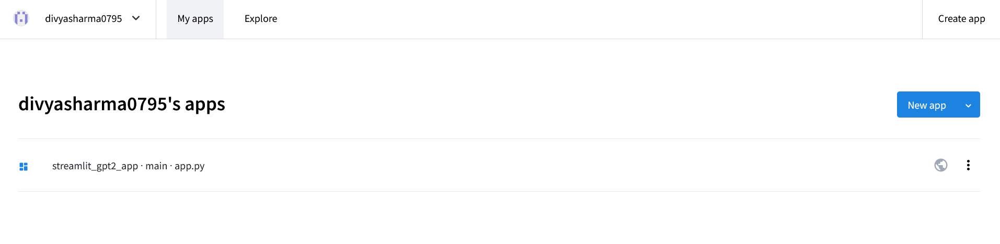

# Week 09 Mini Project - Streamlit App with a Hugging Face Model

This project involves creating a web application using Streamlit and integrating it with a Hugging Face large language model (LLM). The application allows users to generate text based on their input.

## Project Requirements

-   Create a website using Streamlit
-   Connect to an open source LLM (Hugging Face)
-   Deploy model via Streamlit or other service (accessible via browser)

## Project Implementation
This repository contains a Streamlit web application that uses a [Hugging Face](https://huggingface.co/) model to generate text based on user input. The application allows users to enter a text prompt and generate text based on that prompt using openAI's pre-trained language model, [gpt2](https://huggingface.co/openai-community/gpt2).

Project Website - [https://ds655-gpt2.streamlit.app/](https://ds655-gpt2.streamlit.app/)

## Cloning the GitLab Repository

To clone this GitLab repository, follow these steps:

1. Open a terminal.
2. Change the current working directory to the location where you want the cloned directory.
3. Type `git clone`, and then paste the URL of this repository. Press Enter to create your local clone.

```bash
git clone https://gitlab.com/dukeaiml/IDS721/ds655_ids721_miniproject09.git
```


## Steps to build a Streamlit app with a Hugging Face model

### Prerequisites

Before you begin, ensure you have met the following requirements:

-   You have installed the latest version of Python3. If not, you can download it from [here](https://www.python.org/downloads/).
-   You have a Windows/Linux/Mac machine with a stable internet connection.
-   You have read the [Hugging Face model documentation](https://huggingface.co/models).


### Installation

To install the necessary libraries for the project, follow these steps:

-   Clone the repository to your local machine as described in the "Cloning the GitLab Repository" section.
-   Navigate to the project directory in your terminal.
-   Install the necessary Python libraries using pip:

```python
pip install -r requirements.txt
```
This will install all the necessary dependencies, including Streamlit and Transformers.


1. **Install necessary libraries**: This project requires Streamlit and Transformers. You can install them using pip:

```bash
pip install streamlit transformers
```

2. Create a new Python file for the web app: This will be your main app file. Let's call it `app.py`

3. Import necessary libraries: You will need to import Streamlit and Transformers in your `app.py` file:

```python
import streamlit as st
from transformers import pipeline
```

4. Initialize the Hugging Face model: Use the pipeline function from the transformers library to load the model. For example, if you're using a text generation model:

```python
generator = pipeline('text-generation', model='gpt2')
```

5. Create Streamlit app: Use Streamlit's functions to create the interface for your app. For example, you can create a text input for the user to enter some text, and a button to generate text. Here's an example:

```python
st.sidebar.title("Input Options")
input_text = st.sidebar.text_input("Enter some text")
generate_button = st.sidebar.button("Generate")
```

6. Generate text based on user input: When the user clicks the "Generate" button, you can use the Hugging Face model to generate text based on the input. For example:

```python
if generate_button:
    with st.spinner("Generating text..."):
        output_text = generator(input_text)[0]["generated_text"]
    st.subheader("Generated Text:")
    st.write(output_text)
```

7. Run the Streamlit app: You can run the app using the following command:

```bash
streamlit run app.py
```

8. Deploy the app: You can deploy the app using Streamlit's sharing service or other platforms like Heroku or AWS.

## Screenshots

Here are some screenshots of the working website:

Streamlit app running on Localhost:


Web app running on streamlit:



Web app hosted on streamlit:


## License
This project is licensed under the terms of the MIT license. For more details, see the LICENSE file in the project repository.